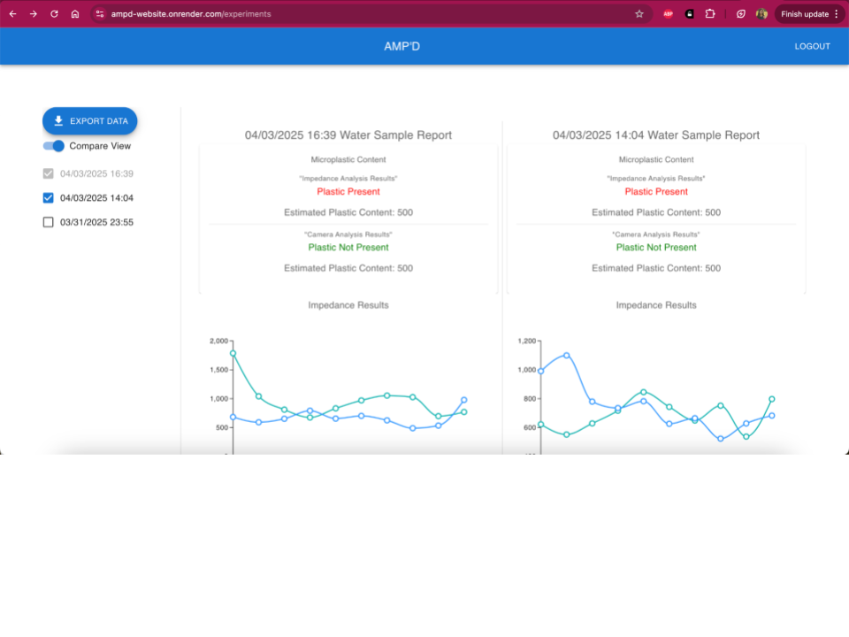

# AMP'D
This project was created by a team of 7 students - Justin Bahr, Carson Dang, Phi Hoang, Hari Narayanam, Alexander Pervizi, Ananya Tadigadapa, and Jonathan Qi, with advisor Professor Canek Fuentes for the Northeastern University Electrical and Computer Engineering Capstone, during the Spring 2025 semester.

The website is deployed using Render at: [https://ampd-website.onrender.com/](https://ampd-website.onrender.com/)

## Purpose of the website
For the project, this website was used as a proof of concept to show how the AMP'D device was able to upload data from its experiments to Google Firebase, and the user could view their experiments and compare them to each other (similar to a git diff). An image of what this looked like is below. 

As the project is over, to avoid maintaining the Firebase subscription for uploading images, this part of the website is no longer functioning, however all the source code is visible under the src/pages/Experiments.tsx file. 

All the code that was running on the AMP'D device itself can be found in [This Repo](https://github.com/AnanyaT129/ampd-gui).

# Citations

This project was bootstrapped with [Create React App](https://github.com/facebook/create-react-app).